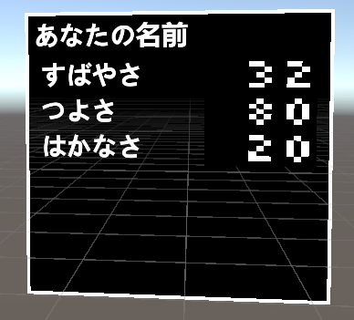

# Avatar Status Window Maker

## 概要

VRChatアバター用にゲームのキャラクターステータスウインドウみたいなやつを作るやつ

## インストール

### VCCによる方法

1. https://vpm.narazaka.net/ から「Add to VCC」ボタンを押してリポジトリをVCCにインストールします。
2. VCCでSettings→Packages→Installed Repositoriesの一覧中で「Narazaka VPM Listing」にチェックが付いていることを確認します。
3. アバタープロジェクトの「Manage Project」から「Avatar Status Window Maker」をインストールします。

## 使い方

AvatarStatusWindowMakerプレハブを突っ込んでよしなにする。

menuってやつをオンにすると数値が弄れるようになる。

Floatパラメーターの精度的に数値のminとmaxが256以上離れていると1ずつ調整は出来ないです。

使用コンポーネントの関係上そのままだとアップロードボタンを押せないので、[Upload without pre-check](https://github.com/Sayamame-beans/Upload-without-preCheck)とかのツールを使って頑張ってアップロードして下さい。

## License

[Zlib License](LICENSE.txt)
